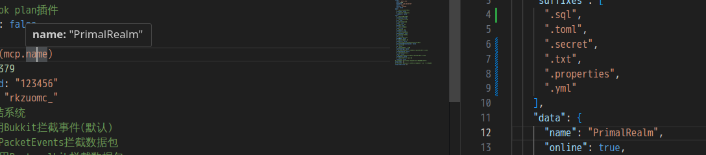
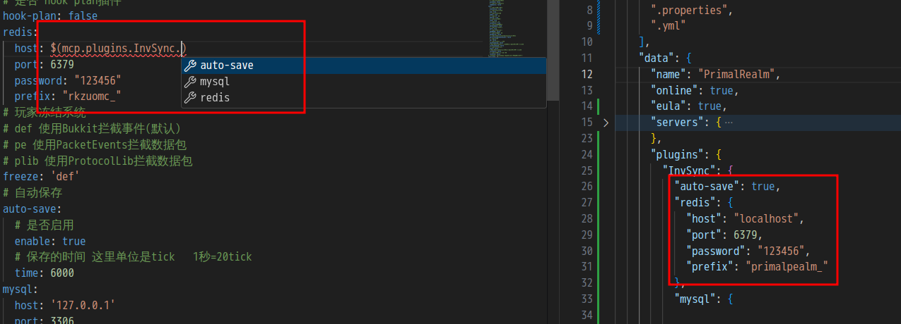

# mcserverpackerhelper README

MCServerPackerHelper 辅助 `MCServerPacker` 工具构建Minecraft服务器

## Features

一些功能

## 要求

使用最新的 `MCServerPacker`

## 使用方法

打开带有`MCServerPacker`的工作区  
`Ctrl + Shift + P` 打开命令窗口  
执行 `Initialize MCP`

## 发行说明

### 1.0.0

基础使用

---

## TODO

- [ ] 支持重构placeholder
